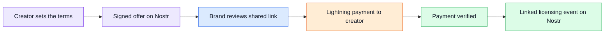

<div align="center">

# CONTENTPORT

### Your content. Your terms. A verifiable record.

A creator-first platform for licensing branded content, receiving direct payments, and publishing independently verifiable offer records.


</div>

---

> **The vision**
>
> Give creators the power to make the first offer, define how their work can be used, and get paid directly—with a signed record that can be verified outside ContentPort.

## The problem

For UGC creators in Kenya, brand deals often begin and end in WhatsApp threads, Instagram DMs, and verbal promises. Price, usage rights, and payment expectations are scattered across conversations. When a brand disappears or an intermediary withholds payment, creators can struggle to establish what was agreed and pursue a remedy.

The same system leaves creators waiting to be discovered. They make the work, but brands and agencies often control when an opportunity becomes a deal.

## The approach

ContentPort starts with a creator-owned offer. A creator produces content for a specific brand, sets a license price and usage terms, and shares a public offer link. The brand can review the terms and pay through Lightning. The planned workflow publishes signed Nostr events for the offer and its licensing status, creating a record that others can inspect independently.

| For creators | For brands |
| :--- | :--- |
| Set prices and license terms upfront | Review the content reference and usage terms in one place |
| Pitch finished work or a campaign concept directly | Act on a clear, specific offer |
| Receive payment directly through Lightning | Pay against an identifiable offer |
| Keep signed, portable records | Reference the offer and licensing record later |

## How it works

1. **Create an offer.** Reference a reel, product demo, or campaign concept. Identify the brand and define the price, permitted uses, and license duration.
2. **Sign and publish.** Publish the offer as a signed Nostr event containing the content reference and license terms.
3. **Share the link.** Send the offer directly through WhatsApp, email, or Instagram DM.
4. **Receive payment.** The brand pays a Lightning invoice intended to settle directly to the creator's wallet.
5. **Record the license.** After payment verification, publish a second signed event referencing the original offer and marking it as licensed.



## Why Nostr and Lightning

**Nostr provides signed, portable records.** Offer terms can be tied to a signing key and checked for alteration. Copies retained by relays or participants can be verified without relying on ContentPort's database.

**Lightning supports direct payment.** The intended payment model routes funds to the creator rather than holding them in a ContentPort balance. Wallet integration and settlement verification will be part of the implementation.

> [!IMPORTANT]
> **Verifiable records, with clear boundaries.** A signature establishes which key signed an event; it does not by itself establish a person's legal identity, brand acceptance, or legal enforceability. An event timestamp is author-supplied, and relay storage is not a guarantee of permanent availability. Licensing status must be backed by a defined payment-verification process, not simply a published claim.

## Proposed technology stack

These are initial architectural choices, not installed dependencies. The stack will be confirmed during implementation.

| Layer | Proposed technology | Purpose |
| :--- | :--- | :--- |
| Frontend | Next.js · React · TypeScript | Creator offer builder and public brand review pages |
| Styling | Tailwind CSS | Responsive, accessible interface |
| Backend | Node.js · TypeScript · Fastify | Offer coordination, payment verification, and event publication |
| Application storage | PostgreSQL | Searchable offer indexes and workflow state |
| Public records | Nostr | Signed offer and licensing events |
| Payments | Bitcoin Lightning Network | Direct creator payments through a compatible wallet integration |

## Initial scope

- Creator-defined offers with content references, prices, usage rights, and durations.
- Signed offer publication to Nostr and shareable offer pages.
- Lightning payment requests linked to individual offers.
- Verified payment handling and publication of linked licensing events.
- A readable record of the offer terms and licensing status.

The first milestone is one complete creator-to-brand licensing flow. Event formats, signing responsibilities, brand acceptance, and payment evidence will be specified before implementation.

## Repository structure

```text
contentport/
├── frontend/       # Reserved for the creator and brand interfaces
├── backend/        # Day 1 schemas, API contract, Nostr builders, and tests
└── README.md       # Project overview and initial direction
```
DEV VS PRODUCTION NOTES
strfry.conf + the strfry service in compose.yaml are local development only. Production points NOSTR_RELAYS at third-party wss:// relays.

> [!NOTE]
> **Current status: backend Day 2 implementation.** Offer API, PostgreSQL storage, signature verification, and queued relay publication code are available alongside the Day 1 contracts. Dependency installation and live database/relay validation remain pending. See the [backend guide](backend/README.md). Frontend and payment integration are not implemented.

## Open-source development

Local database setup is available through [Docker Compose](backend/docs/local-database.md). Run `docker compose up -d --wait postgres` from this repository to start PostgreSQL with persistent storage.

ContentPort is being prepared for open-source development. Contributions will focus on the core licensing flow, protocol design, payment reliability, accessibility, and feedback from Kenyan creators.

A license, contribution guide, and local development instructions will be added as the project takes shape. An open-source license has not yet been selected.
